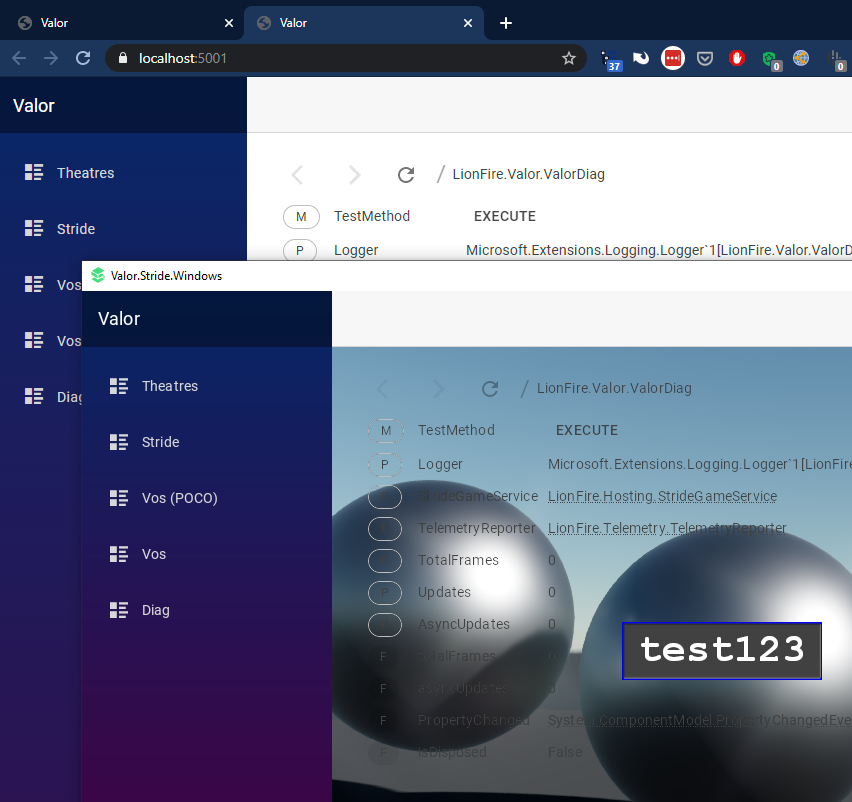

# LionFire.Stride.Ultralight (with Blazor Server)

I have .NET 5.0 + Blazor Server + Ultralig.ht working as a proof of concept inside Stride (stride3d.net) game engine on Windows.  This repo doesn't have a complete working example (feel free to create one) but contains some key files and this README refers you to more detailed info.

Working:
 - Transparency
 - Mouse clicks (left-click only)
 - Toggle the ultralight browser visibility on/off with F10 key (perhaps useful for a debug UI)
 
Partially working:
 - colors in Ultralight are a little bit off.  I'm not sure how perfect of a match to expect.

TODO:
 - Pass through clicks on transparent areas of the browser window to the 3D world
 - Keyboard input
 - Scroll input
 - Middle and right mouse clicks: it looks like these will require changes to Stride's input code, which currently only passes left clicks up to the Stride UI's ImageElement touch events.
 - Require a cookie / auth token to be sent via HTTP when talking to Blazor Server, so that only the Stride Game process can talk to its in-process web server.

## Screenshot

## Stride + Ultralig.ht integration

Based off of this repo -- refer to it for instructions: https://github.com/makotech222/Ultralight-Stride3d_Integration

Here's my customized C# file that supports Microsoft.Extensions.Logging and Mouse Input:  [UltralightUIScript.cs](https://github.com/lionfire/LionFire.Stride.Ultralight/blob/main/StrideGame.Game/Code/UltralightUIScript.cs)

## Stride UI fix

By default, as of now, Stride's postproessing effects are applied to the UI, which makes it look bad.
Refer to here for the full scoop: https://github.com/herocrab/StrideCleanUI

In short:

 1. Set UI to render to group 31
 2. Rework your compositor (I included my compositor asset FWIW: GraphicsCompositor.sdgfxcomp)

## Hosting ASP.NET Core (Blazor Server) alongside Stride

See [StrideGameService.cs](https://github.com/lionfire/LionFire.Stride.Ultralight/blob/main/LionFire.Hosting.Stride/StrideGameService.cs)

 1. Create an ASP.NET Core application (.NET 5.0)
 2. In your `ConfigureServices(IServicesCollection services)` method, do `services.AddHostedService<StrideGameService>();`

A more up to date copy of StrideGameService.cs may be here: 
https://github.com/lionfire/Core/blob/master/src/LionFire.Hosting.Stride/StrideGameService.cs

## Blazor object inspector

The razor component for the fledgling .NET object inspector/explorer I created can be found here:

https://github.com/lionfire/Core/blob/master/src/LionFire.Blazor.Components.MudBlazor/ObjectExplorer.razor

